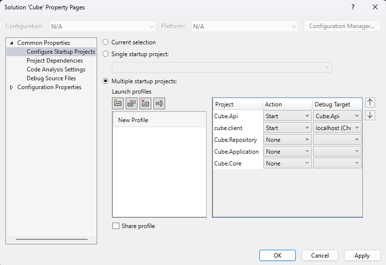

# Cube
## Что за проект?
Это тренировочный проект реализации собственного мессенджера
# Установка, настройка
* Выберете папку в которую скачаете проект и используйте команду git clone [сыллка на репозиторий]
* Далее в папке ../Cube/Cube.Api создайте файл appsettings.personal.json где будут храниться персональные данные c такой структурой:
```json
{
  "Auth": {
    "Secrete": "*"
  },
  "ConnectionStrings": {
    "DefaultConnection": "*"
  },
  "ImagesDirectoryPath" : "*",
  "MaxMessagesReceive": *
}
```
Secrete - используется для JWT токена (длина секрета более 32-х символов);
DefaultConnection - подключение к БД;
ImagesDirectoryPath - путь к папке, где будут храниться картинки загруженные пользователем;
MaxMessagesReceive - максимальное число сообщений, которые пользователь за раз может подгрузить;

* В зависимости от того с какой базой данных вы работаете нужно скачать необходимые инструменты и поменять подключение в файле: ..\Cube\Cube.Api\Configuration\ConfigurationExtensions.cs замените расширение:

	```csharp
	public static void ConfigureRepository(this WebApplicationBuilder builder)
	{
	    var connectionString = builder.Configuration.GetConnectionString("DefaultConnection");

	    builder.Services.AddDbContext<CubeDbContext>(
	        options => options.UseSqlite(builder.Configuration.GetConnectionString("DefaultConnection")));

	    builder.Services.AddScoped<IRepositoryWrapper>(
	        options => new RepositoryWrapper(options.GetRequiredService<CubeDbContext>()));
	}
	```
* В данном преокте я использую базу данных SQLite, для корректной работы необходимо создать файл *.db и в appsettings.personal.json: "DefaultConnection": "Data Source=[путь к файлу *.db]"

* Далее нужно применить миграции:
В Visual Studio View->Other Windows->Package Manager Console
В области Package Manager Console поставте Default Project = Cube.Repository 
Далее установите в качестве запускаемого проекта Cube.Api (right-cklick on Cube.Api in Solution Explorer -> Set as Startup Project)
и в данной консоле выполните команду: update-database

* Нужно настроить развёртывание приложения, для этого зайдите в папку ../Cube/cube.client/.vscode и создайте там launch.json со следующим содержимым:
```json
{
  "version": "0.2.0",
  "configurations": [
    {
      "type": "chrome",
      "request": "launch",
      "name": "localhost (Chrome)",
      "url": "http://localhost:5173",
      "webRoot": "${workspaceFolder}"
    }
  ]
}
```

## Для запуска
Настроить Multiple startup projects:
* right-click on Solution->configure Startup Projets
* применить следующую конфигурацию:


## Документация
[click here](https://docs.google.com/document/d/1uuU6nUzgCSoHaY29WP4AvgfKLC9vyQFm7X9-kLy-8Ko/edit?usp=sharing)
